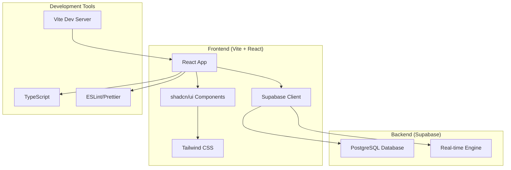

# Design Document

## Overview

This design outlines the architecture for a modern full-stack web application built with Vite, React, Supabase, and shadcn/ui. The application will serve as a robust foundation for scalable web applications, featuring fast development experience, type-safe database operations, real-time functionality, and a consistent design system.

The stack combines:
- **Vite**: Next-generation build tool providing fast HMR and optimized production builds
- **React 18+**: Modern React with hooks, concurrent features, and TypeScript support
- **Supabase**: Open-source Firebase alternative providing PostgreSQL database and real-time subscriptions
- **shadcn/ui**: Accessible, customizable component library built on Radix UI and Tailwind CSS

## Architecture

### High-Level Architecture



### Project Structure

```
src/
├── components/          # Reusable UI components
│   ├── ui/             # shadcn/ui components
│   ├── layout/         # Layout components
│   └── common/         # Common components
├── pages/              # Page components
├── hooks/              # Custom React hooks
├── lib/                # Utility functions and configurations
│   ├── supabase.ts     # Supabase client configuration
│   ├── utils.ts        # General utilities
│   └── validations.ts  # Form validation schemas
├── types/              # TypeScript type definitions
├── styles/             # Global styles and Tailwind config
└── App.tsx             # Main application component
```

## Components and Interfaces

### Core Components

#### 1. Layout Components
- **AppLayout**: Main application layout with navigation
- **Header**: Application header with user menu
- **Sidebar**: Navigation sidebar (if applicable)
- **Footer**: Application footer

#### 2. UI Components (shadcn/ui)
- **Button**: Various button variants and sizes
- **Input**: Form input fields with validation
- **Card**: Content containers
- **Dialog**: Modal dialogs
- **Toast**: Notification system
- **Form**: Form components with validation

### Key Interfaces

#### Supabase Client Configuration
```typescript
interface SupabaseConfig {
  url: string
  anonKey: string
}
```

#### Database Types
```typescript
interface Database {
  public: {
    Tables: {
      // Database tables will be defined based on application needs
    }
  }
}
```

## Data Models

### Application State
```typescript
interface AppState {
  ui: {
    theme: 'light' | 'dark' | 'system'
    sidebarOpen: boolean
  }
}
```

## Error Handling

### Error Boundaries
- **GlobalErrorBoundary**: Catches and displays application-level errors
- **RouteErrorBoundary**: Handles route-specific errors
- **AsyncErrorBoundary**: Manages async operation errors

### Error Types
```typescript
interface AppError {
  code: string
  message: string
  details?: any
  timestamp: Date
}

interface DatabaseError extends AppError {
  type: 'database'
  operation: 'select' | 'insert' | 'update' | 'delete'
}
```

### Error Handling Strategy
1. **Client-side validation**: Form validation using Zod schemas
2. **Server error handling**: Graceful handling of Supabase errors
3. **User feedback**: Toast notifications for errors and success messages
4. **Logging**: Error logging for debugging and monitoring
5. **Fallback UI**: Error boundaries with retry mechanisms

## Testing Strategy

### Testing Pyramid

#### Unit Tests (70%)
- **Component testing**: React Testing Library for UI components
- **Hook testing**: Custom hooks with React Hooks Testing Library
- **Utility testing**: Pure functions and utilities
- **Validation testing**: Zod schemas and form validation

#### Integration Tests (20%)
- **Database operations**: CRUD operations with Supabase
- **Form submissions**: End-to-end form workflows
- **Route navigation**: React Router integration

#### End-to-End Tests (10%)
- **User journeys**: Complete user workflows
- **Cross-browser testing**: Compatibility across browsers
- **Performance testing**: Core Web Vitals and load times

### Testing Tools
- **Vitest**: Fast unit test runner
- **React Testing Library**: Component testing utilities
- **MSW (Mock Service Worker)**: API mocking for tests
- **Playwright**: End-to-end testing framework

### Test Configuration
```typescript
// vitest.config.ts
export default defineConfig({
  plugins: [react()],
  test: {
    globals: true,
    environment: 'jsdom',
    setupFiles: ['./src/test/setup.ts'],
  },
})
```

## Security Considerations

### Data Protection
- **Input validation**: Client and server-side validation
- **SQL injection prevention**: Parameterized queries via Supabase
- **XSS protection**: Content sanitization
- **CSRF protection**: Built-in Supabase protection

### Environment Security
- **Environment variables**: Secure configuration management
- **API key protection**: Proper key scoping and rotation
- **HTTPS enforcement**: Secure communication channels

## Performance Optimization

### Build Optimization
- **Code splitting**: Route-based and component-based splitting
- **Tree shaking**: Unused code elimination
- **Asset optimization**: Image and font optimization
- **Bundle analysis**: Regular bundle size monitoring

### Runtime Performance
- **React optimization**: Memo, useMemo, useCallback usage
- **Lazy loading**: Component and route lazy loading
- **Caching strategies**: Query caching with React Query
- **Image optimization**: Responsive images and lazy loading

### Database Performance
- **Query optimization**: Efficient Supabase queries
- **Indexing**: Proper database indexing
- **Real-time subscriptions**: Optimized subscription management
- **Connection pooling**: Efficient connection management

## Development Workflow

### Development Environment
- **Hot Module Replacement**: Fast development feedback
- **TypeScript**: Type safety and IntelliSense
- **ESLint/Prettier**: Code quality and formatting
- **Git hooks**: Pre-commit linting and testing

### Build Process
1. **Development**: `bun dev` - Start Vite dev server
2. **Type checking**: `bun type-check` - TypeScript validation
3. **Linting**: `bun lint` - ESLint checks
4. **Testing**: `bun test` - Run test suite
5. **Building**: `bun build` - Production build
6. **Preview**: `bun preview` - Preview production build

### Deployment Strategy
- **Static hosting**: Vercel, Netlify, or similar platforms
- **Environment configuration**: Separate dev/staging/production configs
- **CI/CD pipeline**: Automated testing and deployment
- **Database migrations**: Supabase migration management

This design provides a solid foundation for building modern, scalable web applications with excellent developer experience and user experience.